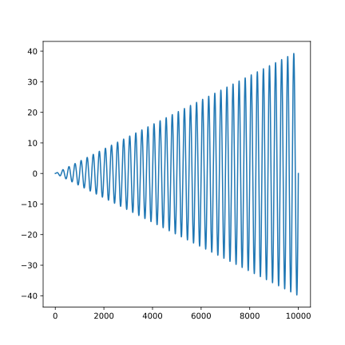

# BashableNotes

Bashable notes allows you to run arbitary commands (inside a customizable docker container) on blocks of code and display their output. Think jupyter notebooks but simpler and more flexable.

Note, this project is still in _very_ early development.

## Code block options
Code block options are written in json one the first line of a code block
    
    ```python 
    {/* Insert options here */}
    print("Hello world!")
    ```
    
The options avalible are:

- `name`: if a file name is provided, the file is saved inside the docker container
- `cmd`: the command to run, `stdout` and `stderr` will be displayed bellow the codeblock
- (more to come)

## Code blocks in action

### Running python

To run python just pipe `$CODE` into `python` via `echo`.

```python
{"cmd":"echo \"$CODE\" | python"}
print("Hello world!")
```

### Image outputs

Want to show some `matplotlib` graphs? Simple save the file then use the markdown image syntax to insert the file.

```python 
{"cmd":"echo \"$CODE\" | python"}
import matplotlib.pyplot as plt
import numpy as np

plt.figure(figsize=[6,6])
x = np.linspace(0,40,10000)
y = x*np.sin(2*np.pi*x)
plt.plot(y)
plt.savefig("graph.svg")
```



### Custom docker container

By default all commands are run inside the `ubuntu:latest` docker container, if you need additional dependencies just create a new docker file.

```dockerfile 
{"name":"Dockerfile"}
FROM ubuntu:latest
RUN apt-get update
RUN apt-get install -y python python-pip python-tk
RUN pip install matplotlib numpy
# Change matplotlib backend to non-interactive
RUN mkdir -p $HOME/.config/matplotlib/
RUN echo "backend : Agg" >> $HOME/.config/matplotlib/matplotlibrc
```

## Upcoming features

- Stream code output instead of waiting execution to terminate
- Parse enviroment variables in via code block options
- HTML form controls set enviroment variables (enabling _interactive_ notebooks)
- Togglable dark theme
- Document overview
- Spinners on queued/executing code
- Ability to stop/pause/resume code execution
- Export options (i.e. markdown (with output), pdf, latex etc)